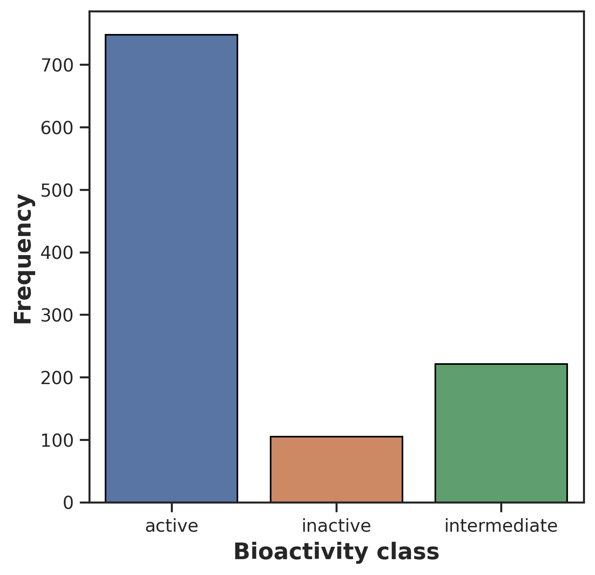
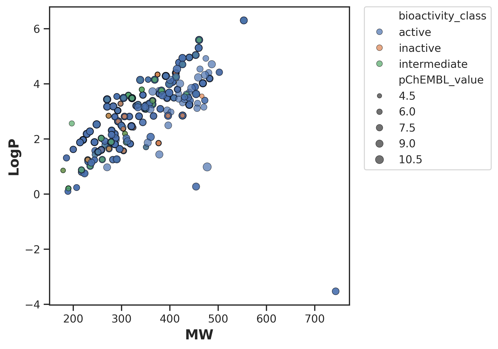
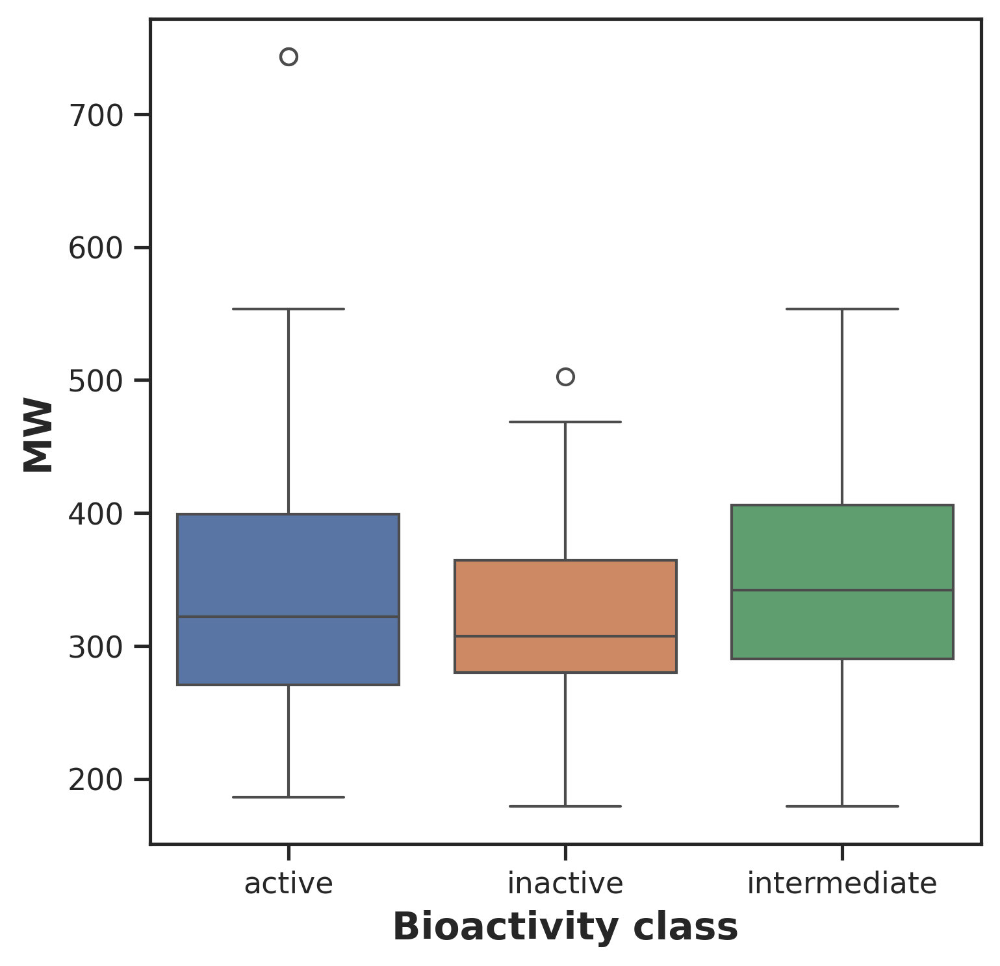
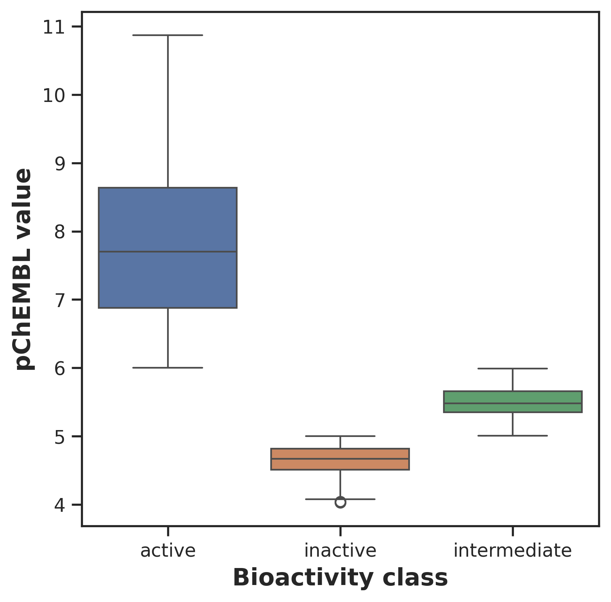

# 🧬 QSAR-Based Bioactivity Prediction

> Predicting the bioactivity of DHFR–TS inhibitors using molecular fingerprints and classical ML.


[](https://python.org)
[](https://jupyter.org)
[](https://scikit-learn.org)
[](https://www.rdkit.org)

---

## 📌 Overview

|                 |                                                         |
| --------------- | ------------------------------------------------------- |
| **Target**      | DHFR–TS                                                 |
| **Data Source** | ChEMBL                                                  |
| **Task**        | Regression (pChEMBL) + Classification (active/inactive) |
| **Approach**    | Molecular Fingerprints → ML Models → Benchmarking       |

---

## 📸 Screenshots

## Exploratory Data Analysis

| figure            |                              plot                               |
| ----------------- | :-------------------------------------------------------------: |
| bioactivity_class |  |
| LogP vs MW        |         |
| MW                |                 |
| pChEMBL           |            |

## ✨ Features

- Molecular descriptor generation: **[e.g. Morgan/ECFP4, MACCS Keys, RDKit Topological]**
- Models benchmarked: **[e.g. Random Forest, XGBoost, SVM, KNN]**
- Scaffold-aware train/test splitting to prevent data leakage
- Regression + classification metrics (R², RMSE, AUC, MCC)
- Interactive prediction app (Streamlit / Gradio)

---

## 📁 Project Structure

```
├─ app.py
├─ data
│  ├─ preprocessed
│  │  └─ bioactivity_preprocessed_data.csv
│  └─ raw
│     └─ CHEMBL1939.csv
├─ fingerprints_xml.zip
├─ LICENSE
├─ models
├─ notebooks
│  ├─ bioactivity_data_preprocessing.ipynb
│  └─ Exploratory_Data_Analysis.ipynb
├─ README.md
├─ results
│  ├─ plots
│  │  ├─ plot_bioactivity_class.pdf
│  │  ├─ plot_ic50.pdf
│  │  ├─ plot_LogP.pdf
│  │  ├─ plot_MW.pdf
│  │  ├─ plot_MW_vs_LogP.pdf
│  │  ├─ plot_NumHAcceptors.pdf
│  │  └─ plot_NumHDonors.pdf
│  ├─ results.zip
│  └─ tables
│     ├─ mannwhitneyu_LogP.csv
│     ├─ mannwhitneyu_MW.csv
│     ├─ mannwhitneyu_NumHAcceptors.csv
│     ├─ mannwhitneyu_NumHDonors.csv
│     └─ mannwhitneyu_pChEMBL_value.csv
├─ screenshots
│  ├─ plot_bioactivity_class.png
│  ├─ plot_MW.png
│  ├─ plot_MW_vs_LogP.png
│  └─ plot_pChEMBL.png
└─ src
```

---

## 🚀 Getting Started

```bash
# Clone the repo
git clone https://github.com/Sakhiur2022/QSAR-modeling-for-DHFR-TS
cd QSAR-modeling-for-DHFR-TS

# Install dependencies
pip install -r requirements.txt

# Run the app
streamlit run app.py
```

---

## 📊 Results Summary

| Fingerprint  | Model         | R²  | RMSE | AUC |
| ------------ | ------------- | --- | ---- | --- |
| Morgan/ECFP4 | Random Forest | —   | —    | —   |
| MACCS Keys   | XGBoost       | —   | —    | —   |
| RDKit Topo   | SVM           | —   | —    | —   |

> Fill in after experiments are complete.

---

## 🗂️ Dataset

- **Source:** [ChEMBL](https://www.ebi.ac.uk/chembl/)
- **Target:** DHFR–TS
- **Size:** ~[N] compounds after filtering
- **Activity Metric:** pChEMBL → converted to pIC50

---

## 🤝 Connect

**Sakhiur** · [LinkedIn](https://www.linkedin.com/in/sakhiur/) · [Portfolio](https://sakhiur.vercel.app)

---

## 📄 License

[MIT](LICENSE)
